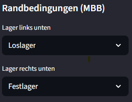
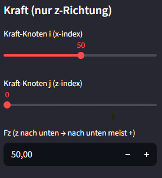
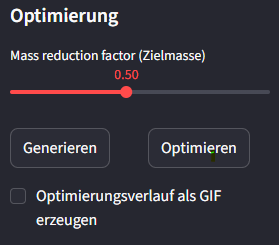
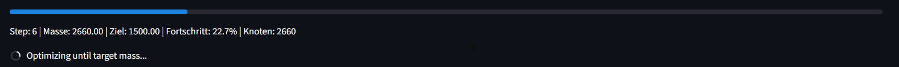
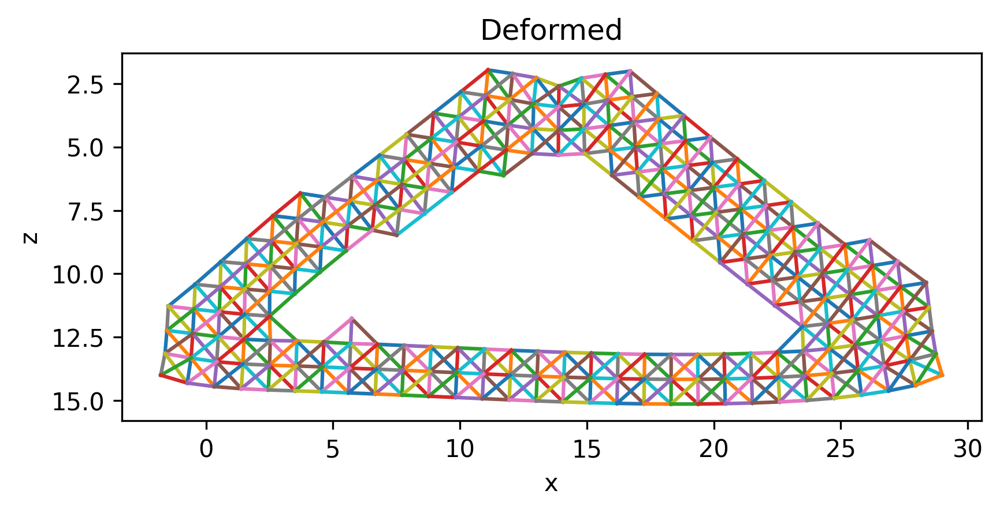
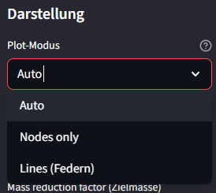
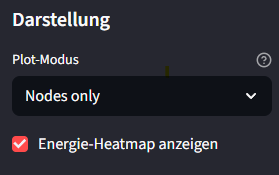
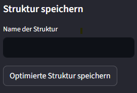
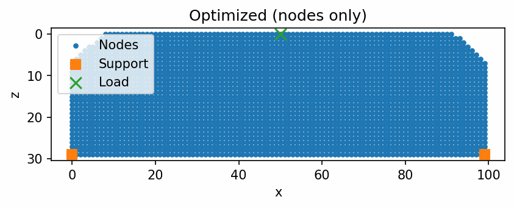

# Abschlussprojekt -- 2D-Federstruktur mit Topologieoptimierung

Dieses Projekt implementiert eine 2D-Federstruktur (Massenpunkte + lineare Federn) mit numerischer Lösung des Gleichungssystems **K · u = F** sowie einer schrittweisen Topologieoptimierung.  
Die Anwendung wird als interaktive Web-App mit **Streamlit** bereitgestellt.

Neben den Minimalanforderungen wurden mehrere Erweiterungen implementiert.

---

# Installation

## 1. Repository klonen

```bash
git clone <REPOSITORY-URL>
cd <REPOSITORY-ORDNER>
```

## 2. Virtuelle Umgebung erstellen

```bash
python -m venv .venv
```

## 3. Virtuelle Umgebung aktivieren

**Windows (PowerShell):**

```bash
.venv\Scripts\activate
```

**Mac / Linux:**

```bash
source .venv/bin/activate
```

## 4. Abhängigkeiten installieren

```bash
pip install -r requirements.txt
```

## 5. Anwendung starten

```bash
streamlit run app.py
```

---

# Projektstruktur

```
abschlussprojekt/
│
├── .venv/
├── src/
│   ├── __init__.py
│   ├── model.py
│   ├── solver.py
│   ├── viz.py
│   ├── optimizer.py
│   └── database.json
│
├── images/
├── app.py
├── requirements.txt
├── README.md
└── .gitignore
```

---

## Erklärung der einzelnen Python-Dateien

### `app.py`
Hauptanwendung der Streamlit-Web-App.

Aufgaben:
- Aufbau der Benutzeroberfläche
- Verarbeitung der Benutzereingaben
- Steuerung von Solver und Optimizer
- Darstellung der Plots
- Download-Funktionen
- GIF-Erstellung
- Speicherung und Laden von Strukturen

`app.py` verbindet alle Module miteinander und bildet die zentrale Steuerungsschicht.

---

### `src/model.py`
Definiert die Datenstruktur des mechanischen Modells.

Enthält:
- Klasse `Node` (Knoten mit Koordinaten, Randbedingungen, Kräften)
- Klasse `Spring` (Feder zwischen zwei Knoten)
- Klasse `Structure` (Gesamtstruktur mit:
  - Knotensammlung
  - Federliste
  - Massenberechnung
  - Adjazenzberechnung
  - Entfernen von Knoten
  - Speichern/Laden über TinyDB)

Warum wichtig?
→ Trennt die Modelllogik sauber von Berechnung und Visualisierung.  
→ Macht die Struktur serialisierbar (Speichern in Datenbank).

---

### `src/solver.py`
Implementiert die numerische Lösung des Gleichungssystems:

\[
K \cdot u = F
\]

Aufgaben:
- Assemblierung der globalen Steifigkeitsmatrix
- Sparse- oder Dense-Berechnung (je nach Verfügbarkeit von SciPy)
- Behandlung von Randbedingungen
- Regularisierung bei singulären Matrizen
- Berechnung der Verschiebungen

Warum wichtig?
→ Herzstück der mechanischen Simulation  
→ Ermöglicht physikalisch korrekte Berechnung der Verformung

---

### `src/optimizer.py`
Implementiert die Topologieoptimierung.

Aufgaben:
- Berechnung der Verformungsenergie
- Bewertung der Knoten (Score-System)
- Entfernen energetisch unwichtiger Knoten
- Sicherstellung der Konnektivität
- Dead-End-Pruning
- Fortschritts-Callback
- Snapshot-Erstellung für GIF

Warum wichtig?
→ Realisiert die eigentliche Optimierungslogik  
→ Reduziert Masse bei Erhalt der strukturellen Stabilität

---

### `src/viz.py`
Verantwortlich für alle Visualisierungen.

Enthält:
- Plot der Originalstruktur
- Plot der deformierten Struktur
- Optimierte Struktur
- Nodes-only-Darstellung (Performance)
- Heatmap-Darstellung
- PNG-Export
- GIF-Erstellung

Warum wichtig?
→ Saubere Trennung zwischen Berechnung und Darstellung  
→ Ermöglicht verschiedene Plot-Modi ohne Logik-Duplikation

---

### `src/__init__.py`
Leere Datei zur Kennzeichnung des Ordners als Python-Package.

Warum wichtig?
→ Ermöglicht Imports wie `from src.model import ...`  
→ Erhöht Portabilität und Kompatibilität

---

### `database.json`
TinyDB-Datenbank zur Speicherung optimierter Strukturen.

Warum wichtig?
→ Ermöglicht dauerhaftes Speichern mehrerer Strukturen  
→ Realisiert das erweiterte Speichersystem

---

# Verwendete Technologien

- Python  
- NumPy  
- SciPy  
- Matplotlib  
- Streamlit  
- TinyDB  
- ImageIO  

---

# Funktionsweise des Optimizers

1. Modell initialisieren  
2. Gleichungssystem **K · u = F** lösen  
3. Verformungsenergie berechnen  
4. Wichtigkeit der Knoten bestimmen  
5. Schwächste Knoten entfernen  
6. Konnektivität prüfen  
7. Wiederholen bis Zielmasse erreicht oder Struktur instabil  

---

# Erweiterungen

## Auswahl der Lagerung



---

## Auswahl des Kraftangriffspunkts



---

## Optimierungsziel



---

## Fortschrittsanzeige der Optimierung



---

## Plot-Modi

### Nodes only
.png)

### Lines (Federn)


### Plot-Modus Auswahl


---

## Plot als Heatmap



### Heatmap – Nodes only
.png)

### Heatmap – Lines
.png)

---

## Erweitertes Speichersystem



---

# Darstellung der Optimierung als GIF



---

# Autor:innen

Artur Surberg  
Julian Köll  

Projekt im Rahmen des Moduls **Softwaredesign**
